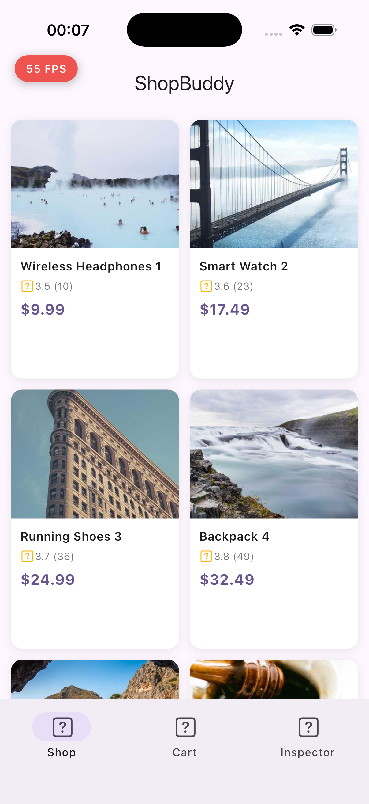
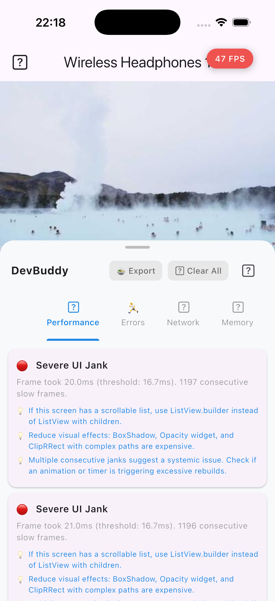
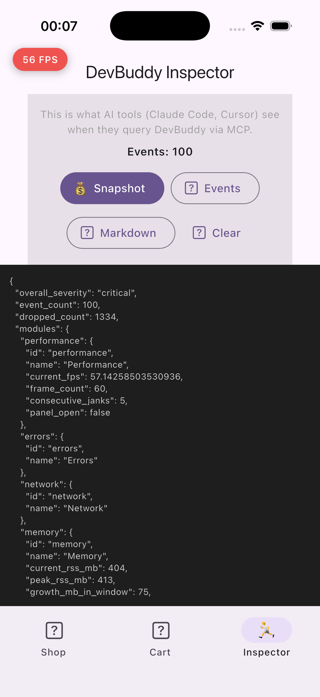

<div align="center">

# DevBuddy

**Flutter diagnostics that tell you what's wrong and how to fix it.**

Zero setup. AI-powered. Zero cost in release builds.

[](https://github.com/abdullahtas0/dev-buddy/actions/workflows/ci.yml)
[](LICENSE)
[](https://flutter.dev)
[](https://dart.dev)


</div>

<p align="center">
  <video src="https://github.com/user-attachments/assets/demo_video.mp4" width="320" autoplay loop muted playsinline>
    
  </video>
</p>

<p align="center">
  
  
  
</p>

<p align="center">
  <sub>Live FPS overlay | Jank detection with fix suggestions | AI-queryable inspector</sub>
</p>

---

## Why DevBuddy?

Flutter DevTools requires context switching. Logging packages show raw data. Neither tells you **what to fix**.

DevBuddy runs inside your app, detects problems in real-time, and suggests specific code changes. AI IDEs like Claude Code can query it directly via MCP.

| | DevTools | Talker | Alice/Chucker | **DevBuddy** |
|-|---------|--------|---------------|-------------|
| In-app overlay | | | Partial | **Full** |
| FPS + jank detection | External | | | **Built-in** |
| Network inspection | Basic | | Yes | **Headers + Body** |
| Error translation | | Logging | | **25+ patterns** |
| Memory leak detection | External | | | **Built-in** |
| State time-travel | | | | **Riverpod + BLoC** |
| AI integration (MCP) | | | | **9 tools** |
| Widget rebuild tracking | External | | | **Per-second rate** |
| Release overhead | N/A | Minimal | Minimal | **Zero bytes** |

## Quick Start

```yaml
dependencies:
  dev_buddy: ^0.2.0
```

```dart
import 'package:dev_buddy/dev_buddy.dart';

MaterialApp(
  builder: (context, child) => DevBuddyOverlayImpl(
    enabled: kDebugMode,
    modules: [
      PerformanceModule(),      // FPS, jank, frame timing
      ErrorTranslatorModule(),  // 25+ Flutter error patterns → fix suggestions
      NetworkModule(),          // HTTP traffic monitoring
      MemoryModule(),           // RSS tracking, leak heuristics
      RebuildTrackerModule(),   // Widget rebuild rate per second
    ],
    child: child!,
  ),
)
```

In release builds, this compiles to **zero bytes** via conditional compilation and tree-shaking.

## How It Works

```
Your App                          DevBuddy
┌──────────────┐    ┌─────────────────────────────────┐
│              │    │ FPS pill (live, draggable)       │
│  Screens     │    │     ↓ tap                        │
│  Widgets     │◄──►│ Diagnostic panel                │
│  Network     │    │   ├ Performance (jank + FPS)     │
│  State       │    │   ├ Errors (translated)          │
│              │    │   ├ Network (requests + timing)  │
│              │    │   ├ Memory (RSS + leak warning)  │
│              │    │   └ Rebuilds (per-second rate)   │
└──────────────┘    └─────────────────────────────────┘
                           ↓ MCP
                    ┌──────────────┐
                    │ Claude Code  │
                    │ Cursor       │
                    │ "Fix the     │
                    │  jank issue" │
                    └──────────────┘
```

## Diagnostic Modules

### Performance
Monitors frame timing via `SchedulerBinding`. Uses **vsync-to-vsync intervals** for accurate FPS (validated against DevTools: < 2 FPS delta). Detects jank, reports consecutive slow frames, and suggests fixes like `const` constructors and `ListView.builder`.

### Network
Intercepts HTTP traffic from **any client** via `HttpOverrides`. Shows request URL, status code, duration, headers, and body preview. Flags slow requests (> 2s) and auth failures.

### Memory
Samples `ProcessInfo.currentRss` every 5 seconds. Tracks peak usage, growth rate, and detects monotonic growth patterns that suggest leaks. Validated: < 6 MB delta vs OS-reported RSS.

### Rebuilds
Hooks into `debugOnRebuildDirtyWidget` to count rebuilds per widget type. Shows **per-second rate** (not misleading cumulative totals) with session duration tracking.

### Errors
Matches 25+ common Flutter error patterns (RenderFlex overflow, setState after dispose, missing MediaQuery, etc.) and translates them into human-readable explanations with fix suggestions.

## State Time-Travel

Track every state change across **any** state management library:

```dart
// Riverpod
ProviderScope(
  observers: [DevBuddyRiverpodObserver(stateStore: engine.stateStore)],
  child: MyApp(),
)

// BLoC
Bloc.observer = DevBuddyBlocObserver(stateStore: engine.stateStore);
```

State is stored as serialized JSON in a ring buffer with 20 MB RAM budget. Diffs are computed automatically.

## AI Integration (MCP)

DevBuddy bridges live diagnostics to Claude Code, Cursor, and VS Code via [Model Context Protocol](https://modelcontextprotocol.io).

**1. Your app already starts the diagnostic server** (default: `enableMcpServer: true`)

**2. Add `.mcp.json` to your project:**
```json
{
  "mcpServers": {
    "dev-buddy": {
      "command": "dart",
      "args": ["run", "dev_buddy_mcp"]
    }
  }
}
```

**3. Ask your AI:**
```
"Check my Flutter app for performance issues"
"Which network requests are slow?"
"Why is FPS dropping when I scroll?"
```

### 9 Diagnostic Tools

| Tool | Returns |
|------|---------|
| `diagnostics` | FPS, memory, severity, top issues |
| `suggest` | AI-friendly fix suggestions |
| `search_events` | Events filtered by module/severity/text |
| `search_network` | Requests with URL, status, duration |
| `search_state` | State history for time-travel |
| `detail` | Full event with metadata |
| `performance` | Frame timing and jank analysis |
| `memory` | RSS, peak, growth rate |
| `errors` | Translated errors with fixes |

All data is **PII-sanitized** (14 patterns: JWT, credit cards, AWS/GCP keys, emails, SSN, phone numbers). Data never leaves localhost.

## Packages

| Package | Description |
|---------|-------------|
| [`dev_buddy_engine`](packages/dev_buddy_engine/) | Pure Dart engine — zero dependencies |
| [`dev_buddy`](packages/dev_buddy/) | Flutter overlay with 5 modules |
| [`dev_buddy_dio`](packages/dev_buddy_dio/) | Dio interceptor (pure Dart) |
| [`dev_buddy_http`](packages/dev_buddy_http/) | http package wrapper (pure Dart) |
| [`dev_buddy_riverpod`](packages/dev_buddy_riverpod/) | Riverpod state tracking |
| [`dev_buddy_bloc`](packages/dev_buddy_bloc/) | BLoC/Cubit state tracking |
| [`dev_buddy_mcp`](packages/dev_buddy_mcp/) | MCP server for AI IDEs |
| [`dev_buddy_devtools`](packages/dev_buddy_devtools/) | Flutter DevTools extension |

## Architecture

```
dev_buddy_engine (Pure Dart, zero deps)
    ├── dev_buddy (Flutter overlay)
    ├── dev_buddy_dio (Dio adapter)
    ├── dev_buddy_http (http adapter)
    ├── dev_buddy_riverpod (State tracking)
    ├── dev_buddy_bloc (State tracking)
    ├── dev_buddy_mcp (AI integration)
    └── dev_buddy_devtools (DevTools extension)
```

**Engine highlights:**
- **Adaptive batching** — Nagle-inspired 3-tier: IMMEDIATE (errors), FAST (network), LAZY (metrics)
- **Ring buffer state store** — 20 MB RAM budget, hashCode pre-filter, anchor/diff compression
- **Cross-signal correlation** — 5 rules connecting jank + rebuilds, memory + navigation, network + jank
- **Crash-safe audit log** — .jsonl format survives app crashes
- **WCAG 2.1 accessibility audit** — Touch targets, semantic labels, image descriptions

## Development

```bash
dart pub global activate melos
melos bootstrap
melos run test          # 340+ tests across 9 packages
melos run qualitycheck  # Full CI: clean + lint + test
```

## Contributing

See [CONTRIBUTING.md](CONTRIBUTING.md) for setup, code style, and PR process.

## License

MIT License. See [LICENSE](LICENSE) for details.
