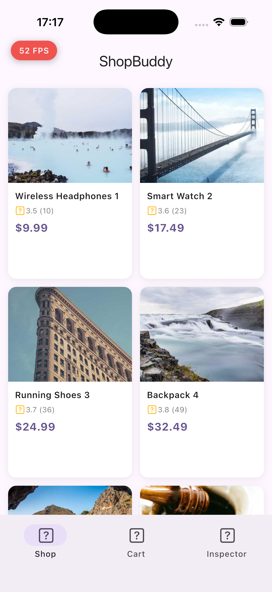
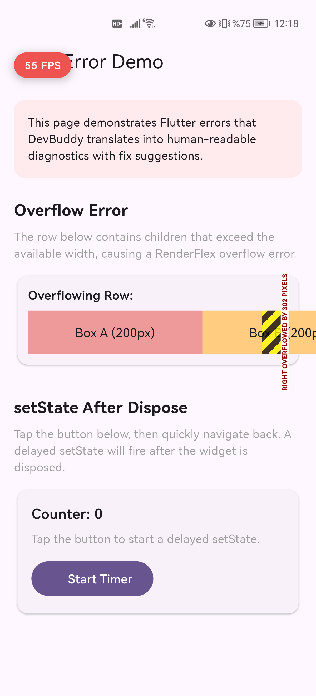
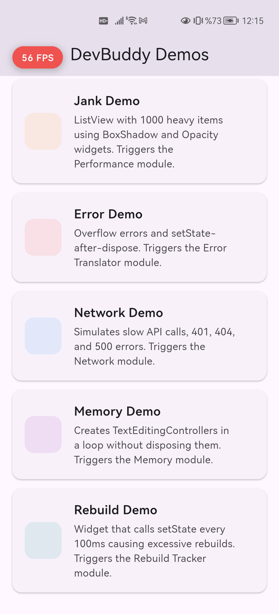

# DevBuddy

[](https://github.com/abdullahtas0/dev-buddy/actions/workflows/ci.yml)
[](LICENSE)
[](https://flutter.dev)
[](https://dart.dev)


**Unified Flutter Debugging Platform** — Not Metrics, Solutions.

The successor to ByteDance's flutter_ume. One tool to replace DevTools context-switching, scattered logging packages, and manual debugging.

<p align="center">
  
  
  
</p>

## What Makes DevBuddy Different

| Feature | DevTools | Talker | Alice/Chucker | **DevBuddy** |
|---------|---------|--------|---------------|-------------|
| In-app overlay | - | - | Partial | **Full** |
| Performance monitoring | External | - | - | **Built-in** |
| Network inspection | Basic | - | Yes | **Waterfall + Body** |
| Error translation | - | Logging | - | **25+ patterns** |
| Memory leak detection | External | - | - | **Built-in** |
| State time-travel | - | - | - | **Universal** |
| AI integration (MCP) | - | - | - | **9 tools** |
| Accessibility audit | - | - | - | **WCAG 2.1** |
| Plugin architecture | - | - | - | **Extensible** |
| Release overhead | N/A | Minimal | Minimal | **Zero** |

## Quick Start

```yaml
# pubspec.yaml
dependencies:
  dev_buddy: ^0.2.0
```

```dart
import 'package:dev_buddy/dev_buddy.dart';

MaterialApp(
  builder: (context, child) => DevBuddyOverlayImpl(
    enabled: kDebugMode,
    modules: [
      PerformanceModule(),
      ErrorTranslatorModule(),
      NetworkModule(),
      MemoryModule(),
      RebuildTrackerModule(),
    ],
    child: child!,
  ),
)
```

That's it. In release builds, DevBuddy compiles to **zero bytes** via tree-shaking.

## How It Works

1. DevBuddy runs **silently** in the background while you use your app
2. A floating pill shows **live FPS** in the corner
3. Pill turns **orange/red** when issues are detected
4. Tap the pill → diagnostic panel opens with actionable suggestions
5. AI tools (Claude Code, Cursor) can query diagnostics via MCP

## Packages

| Package | Version | Description |
|---------|---------|-------------|
| [`dev_buddy_engine`](packages/dev_buddy_engine/) | 0.2.0 | Pure Dart engine — EventBus, StateStore, analyzers, sanitization |
| [`dev_buddy`](packages/dev_buddy/) | 0.2.0 | Flutter overlay with 5 diagnostic modules |
| [`dev_buddy_dio`](packages/dev_buddy_dio/) | 0.2.0 | Dio HTTP interceptor with header/body capture |
| [`dev_buddy_http`](packages/dev_buddy_http/) | 0.2.0 | http package wrapper with enriched events |
| [`dev_buddy_riverpod`](packages/dev_buddy_riverpod/) | 0.2.0 | Riverpod state tracking for time-travel |
| [`dev_buddy_bloc`](packages/dev_buddy_bloc/) | 0.2.0 | BLoC/Cubit state tracking for time-travel |
| [`dev_buddy_mcp`](packages/dev_buddy_mcp/) | 0.2.0 | MCP server for AI IDE integration |
| [`dev_buddy_devtools`](packages/dev_buddy_devtools/) | 0.2.0 | Flutter DevTools extension |

## State Time-Travel

Track every state change across **any** state management library:

```dart
// Riverpod
ProviderScope(
  observers: [DevBuddyRiverpodObserver(stateStore: engine.stateStore)],
  child: MyApp(),
)

// BLoC
Bloc.observer = DevBuddyBlocObserver(stateStore: engine.stateStore);
```

## AI Integration (MCP)

DevBuddy exposes 9 MCP tools for Claude Code, Cursor, and Copilot:

| Tool | What It Returns |
|------|----------------|
| `dev_buddy/diagnostics` | Compact snapshot: FPS, memory, top issues |
| `dev_buddy/suggest` | AI-friendly fix suggestions |
| `dev_buddy/search_events` | Query events by module/severity/text |
| `dev_buddy/search_network` | Filter requests by URL/status/duration |
| `dev_buddy/search_state` | Query state change history |
| `dev_buddy/detail` | Full event details (lazy loading) |
| `dev_buddy/performance` | Frame timing and jank analysis |
| `dev_buddy/memory` | Memory trend and leak detection |
| `dev_buddy/errors` | Error catalog matches with fixes |

All responses are **PII-sanitized** (auth headers, emails, JWT tokens automatically scrubbed).

## Architecture

```
dev_buddy_engine (Pure Dart, zero deps)
    ├── dev_buddy (Flutter overlay)
    ├── dev_buddy_dio (Dio adapter)
    ├── dev_buddy_http (http adapter)
    ├── dev_buddy_riverpod (State tracking)
    ├── dev_buddy_bloc (State tracking)
    ├── dev_buddy_mcp (AI integration)
    └── dev_buddy_devtools (DevTools extension)
```

### Engine Highlights

- **Adaptive Batching** — IMMEDIATE (errors), FAST (network), LAZY (metrics)
- **State Time-Travel** — Ring buffer with 20MB RAM budget, hashCode pre-filter
- **Cross-Signal Correlation** — 5 rules that connect jank, rebuilds, memory, network
- **PII Sanitization** — 3-tier scrubbing before any data leaves to AI
- **Accessibility Audit** — WCAG 2.1 touch targets, semantic labels
- **Performance Baselines** — Auto-detect regressions between builds
- **Crash-Safe Logging** — .jsonl audit log survives app crashes

## Development

```bash
dart pub global activate melos
melos bootstrap
melos run test              # 298 tests across 9 packages
melos run qualitycheck      # Full CI: clean + lint + test
```

## Contributing

See [CONTRIBUTING.md](CONTRIBUTING.md) for setup, code style, and PR process.

## Changelog

See [CHANGELOG.md](CHANGELOG.md) for version history.

## License

MIT License. See [LICENSE](LICENSE) for details.
